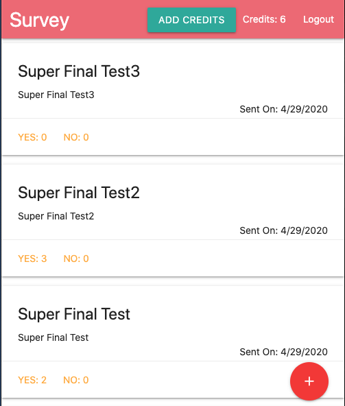

# Automate Survey Collection

## The Purpose of this app

This application sends email surveys and collects responses. It is a full stack application I created for fun. This application is based on the course by Stephen Grider from Udemy.com.

The finished [demo](https://desolate-plateau-73931.herokuapp.com/) is on Heroku.

</img>

# App Flow

1. Sign up with Google

2. Add credits by inserting arbitrary credit card numbers

3. Enter Info for email survey and recipients

4. View response on dashboard

## Tech Stack

* Frontend: React, Redux

* Backend: Express

* Authentication: Goolge OAuth

* Email Service: Sendgrid

* Database: MongoDB

* Payment: Stripe

